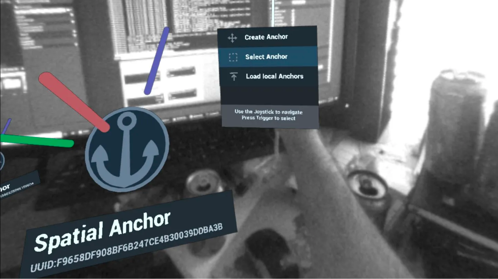
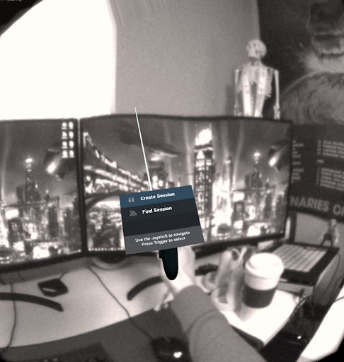
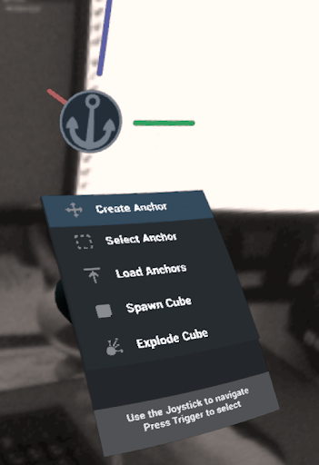
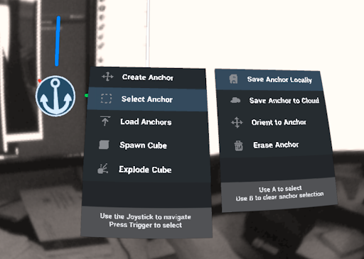
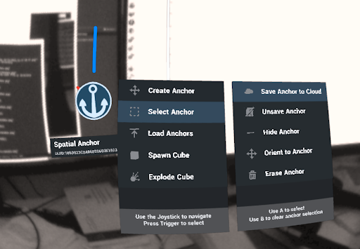
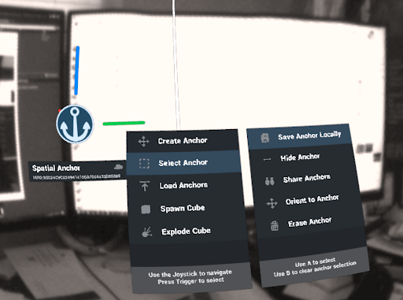

# Shared Anchors Sample

<oc-devui-note color="note">Unreal Engine 4 is the only Unreal Engine version that supports sharing anchors.</oc-devui-note>
<oc-devui-note color="note">Sharing anchors is available for Meta Quest Pro on v47 or higher, and for Quest 2 on v49 or higher. Quest 1 does not support sharing anchors.</oc-devui-note>

This sample demonstrates the usage of [Spatial Anchors](https://developer.oculus.com/documentation/unreal/unreal-spatial-anchors/).

The Shared Spatial Anchors sample project demonstrates the capabilities of the Spatial Anchors system. This sample project also provides example code for handling and maintaining spatial anchors, which you may reuse in your own projects. The sample also makes use of Unreal’s saving and loading systems to store the UUIDs of persisted anchors to app storage.



## Design

* **BP_MenuItem**: The menu items are the interface actors of the menu. They contain the logic for the visual feedback of the current interaction and for calling the Event Dispatcher to run logic elsewhere in the project.

* **BP_Menu_Main**: This menu handles all the general operations of anchors that don't relate to individual anchors. That is, creating, selecting, and loading anchors.

* **BP_Menu_Anchor**: This menu handles all the operations specific to interacting with selected anchors. This includes saving, unsaving, hiding, and erasing selected anchors.

## User Interactions

- Move the thumbstick on the right Touch controller up and down to select menu items.
- To create a spatial anchor, select **Create Anchor** and then squeeze the trigger.
- To save a spatial anchor to storage:
    1. Go to **Select Anchor**.
    2. Point to the spatial anchor you want to save.
    3. With **Select Anchor** selected, squeeze the trigger.
    4. Select **Save Anchor**, and then press A. The anchor is saved to headset storage and to the Unreal save game.
- To load saved Spatial Anchors back into the app in subsequent sessions, select **Load Anchors**.

## Lobby

When first opening the app you are placed into a waiting room with passthrough enabled. There is a menu attached to your right controller. There are two options.

* **Create Session**:  Selecting this option will create a new local network game session that you will automatically be connected to.
* **Find Session**: Selecting “Find Session” will search for an available local internet session that another local player created. If one is found you will connect to it automatically, otherwise the text will turn red and you will stay in the lobby.



## Shared Scene

After creating or joining a network session you will be in a passthrough environment. There is a menu attached to your right controller and has the following options:
* **Create Anchor**: Selecting this option will create a new anchor, the position is defined by a preview anchor visible at the top of the controller.
* **Select Anchor**: When hovering over an anchor in the environment, selecting this option will open a new menu specific to anchors.
* **Load Anchors**: This option will load any anchors that were previously saved via the Save Anchors button.
* **Spawn Cube**: Using this option will spawn a networked cube in the environment, it will spawn from the top of your controller.
* **Explode Cube**: Using this menu option while hovering over a cube in the environment will shoot the cube up into the air.



## Anchor Menu
After spawning and selecting an anchor, an extra menu attached to your right controller appears. This is the anchor menu. Default options are:

* **Save Anchor Locally**: Saves the anchor to your local device.
* **Save Anchor to Cloud**: Saves the anchor to cloud storage. After saving to the cloud you can share the anchor with other users of the session.
* **Orient to Anchor**: This button makes the origin of the world the specified anchor. If you attempt to use this button with more than one anchor the first selected anchor will be used.
* **Erase Anchor**: Deletes the anchor from the scene, and if saved locally, removes the anchor from local storage.



### Local Storage
After saving the anchor locally, the following options appear:

* **Save Anchor to Cloud**: Saves the anchor to cloud storage. After saving to the cloud you can share the anchor with other users of the session.
* **Unsave Anchor**: Remove the local anchor from local storage, but do not remove the anchor from the scene.
* **Hide anchor**: Hides the visual representation of the anchor from the scene but the anchor is still saved in local storage.
* **Orient to Anchor**: Orient the entire scene to the selected anchor.
* **Erase Anchor**: Delete the anchor from the game world and remove it from local storage.



## Cloud Storage
If you save the anchor to cloud storage, the following options appear:

* **Save Anchor Locally**: Saves the anchor to your local device.
* **Hide Anchor**: Hides the anchor representation, the anchor still exists and you cannot retrieve it when you reboot the app.
* **Share Anchors**: Share the anchor with any users connected to your session. The other connected users will automatically receive and load the anchors.
**Orient To Anchor**: Orient the entire world to the specified anchor.
* **Erase Anchor**: Erases the anchor representation from the game world but does not remove it from cloud storage.



## How to Use

### Load the project

First, ensure you have Git LFS installed by running this command:
```sh
git lfs install
```

Then, clone this repo using the "Code" button above, or this command:
```sh
git clone https://github.com/oculus-samples/Unreal-SharedAnchorsSample
```

### Launch the project in the Unreal Editor using one of the following options.

#### Epic Games Launcher with MetaXR plugin

The easiest way to get started is to use the prebuilt Unreal Engine from the Epic Games Launcher, with MetaXR plugin.

1. Install the [Epic Games Launcher](https://www.epicgames.com/store/en-US/download)
2. In the launcher, install UE5 (recommended).
3. Download and install the MetaXR plugin from the [Unreal Engine 5 Integration download page](https://developer.oculus.com/downloads/package/unreal-engine-5-integration).
3. Launch the Unreal Editor
4. From "Recent Projects", click "Browse" and select `SharedAnchorsSample.uproject`

#### Meta fork of Epic’s Unreal Engine

The Meta fork of Epic’s Unreal Engine will give you the most up to date integration of Oculus features. However, you must build the editor from its source.

Follow the instructions on [Accessing Unreal Engine source code on GitHub](https://www.unrealengine.com/en-US/ue-on-github) to obtain:
- an Epic account
- a GitHub account
- authorization to access the Unreal Engine source repository
Disregard instructions on downloading Epic’s Unreal Engine source code as you will be building the Meta fork of Epic’s Unreal Engine source.

Make sure you have Visual Studio installed properly:
- Launch the Visual Studio Installer and click Modify for the Visual Studio version you want to use.
- Under the Workloads tab, click Game development with C++ if it isn’t checked and then click Modify.

1. Download the source code from the [Meta fork of Epic’s Unreal Engine on GitHub](https://github.com/Oculus-VR/UnrealEngine).
2. Follow Epic’s instructions on [Building Unreal Engine from Source](https://docs.unrealengine.com/5.2/en-US/building-unreal-engine-from-source/) to complete the process.

Depending on your machine, the build may take awhile to complete.

# Licenses
The Meta License applies to the SDK and supporting material. The MIT License applies to only certain, clearly marked documents. If an individual file does not indicate which license it is subject to, then the Meta License applies.
